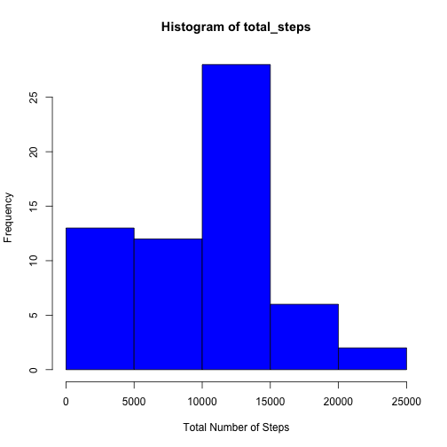

# Reproducible Research: Peer Assessment 1

## Set your working directory

setwd("~/Desktop/nat/otros estudios/coursera/data specialization/5.Reproducible Research/project1/RepData_PeerAssessment1")

## Loading and preprocessing the data

```{r}
data <- read.csv("activity.csv", colClasses = c("numeric", "Date", "numeric"))
```

## What is mean total number of steps taken per day?
### Make a histogram of the total number of steps taken each day

```{r}
split <- split(data, data$date)
total_steps <- sapply(X = split, FUN = function(x) sum(na.omit(x$steps)))
hist(total_steps)
```

 

### Calculate and report the **mean** and **median** total number of steps taken per day

```r
steps <- sapply(X = split, FUN = function(x) sum(na.omit(x$steps)))
mean <- mean(steps, na.rm = TRUE)
median <- median(steps, na.rm = TRUE)
```

The mean is 9354.2295 and the median is 1.0395 &times; 10<sup>4</sup>.
## What is the average daily activity pattern?
1. Make a time series plot (i.e. `type = "l"`) of the 5-minute interval (x-axis) and the average number of steps taken, averaged across all days (y-axis)

2. Which 5-minute interval, on average across all the days in the dataset, contains the maximum number of steps?
Sorry I couldn't finished on time

```r

max_num_steps <- which(data2 == max(na.omit(data2$steps)))
```

```
## Error: object 'data2' not found
```

```r
max_num_steps
```

```
## Error: object 'max_num_steps' not found
```

```r
data2[max_num_steps, ]
```

```
## Error: object 'data2' not found
```

## Imputing missing values


## Are there differences in activity patterns between weekdays and weekends?
